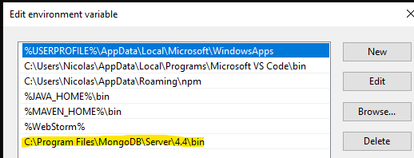

### Pasos:
#### Instalar mongo
#### Agregar binarios carpeta bin a path
C:\Program Files\MongoDB\Server\4.4\bin

#### Crear carpeta para la base
mkdir db
#### Ejecutar servidor en terminal
mongod --dbpath ./db
#### Conectar cliente
mongo
#### Cargar datos
copiar y pegar en la terminal el codigo que esta en scripts

## Endpoints
#### GET cancion
Trae todas las canciones
### GET cancion/list
Trae las canciones con el campo `isActive` igual a `true`
### GET cancion/:id
Trae una cancion por el `id`
### POST cancion
Agrega una cancion a la base
### PATCH cancion/delete/:id
Baja logica. Setea el campo `isActive` a `false`
### PATCH cancion/:id
Actualiza una cancion
